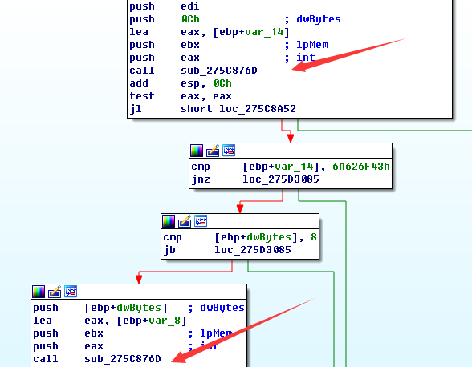
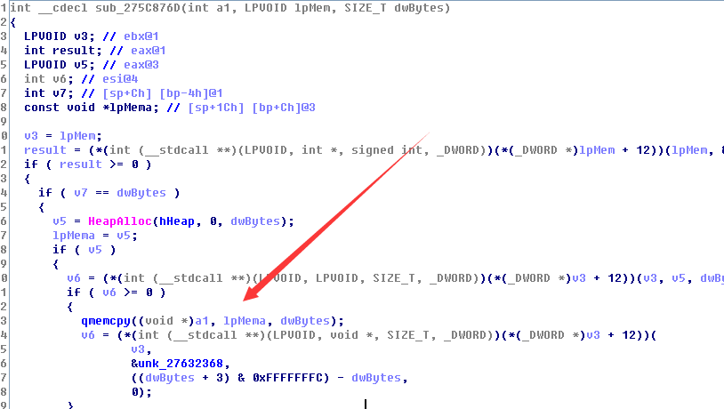
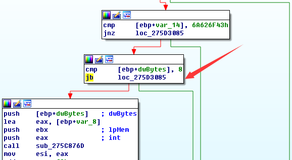

###0x00文件###
***
环境：xp sp3  
虚拟机：vmware  
调试器：windbg od  
反汇编器： IDA Pro  
漏洞软件：office 2013 

###0x01定位漏洞点###
***
首先打开poc文件，经测试，此poc文件能够在本环境运行成功，所以直接下一个WinExec断点。 
 
	Breakpoint 0 hit
	eax=00121637 ebx=0001c000 ecx=00121578 edx=7c92e514 esi=0001c000 edi=07cf6596
	eip=7c863231 esp=00121584 ebp=0012159c iopl=0         nv up ei pl nz na po nc
	cs=001b  ss=0023  ds=0023  es=0023  fs=003b  gs=0000             efl=00000202
	kernel32!WinExec:
	7c863231 8bff            mov     edi,edi
看下WinExec参数

	0:000> db 01bd238 
	001bd238  43 3a 5c 44 6f 63 75 6d-65 6e 74 73 20 61 6e 64  C:\Documents and
	001bd248  20 53 65 74 74 69 6e 67-73 5c 41 64 6d 69 6e 69   Settings\Admini
	001bd258  73 74 72 61 74 6f 72 5c-61 2e 65 78 65 00 00 00  strator\a.exe...
发现a.exe，初步判定程序已经在shellcode当中，这个poc应该是复制系统的计算器到用户目录下，然后运行这个计算器。既然这样，我们就可以一层一层向上查找，肯定能找到漏洞点。

查看一下栈回溯。

	0:000> kb
	ChildEBP RetAddr  Args to Child              
	WARNING: Stack unwind information not available. Following frames may be wrong.
	00121580 0012184e 001bd238 00000000 001bd238 kernel32!WinExec
	*** ERROR: Symbol file could not be found.  Defaulted to export symbols for C:\WINDOWS\system32\MSCOMCTL.OCX - 
	001215b0 275c8a0a 07cf65a0 07cd7858 0001c000 0x12184e
	001215ec 00121665 1005c48b c7000001 4d032400 MSCOMCTL!DllGetClassObject+0x41cc6
	00000000 00000000 00000000 00000000 00000000 0x121665

重新运行程序，断点处MSCOMCTL!DllGetClassObject+0x41cc0(275c8a04)  
p指令一直运行下去，运行到下面，通过查看esp，发现这里就是覆盖返回地址为7ffa4512
	Object+0x41cfc:
	275c8a40 ff1540155827    call    dword ptr [MSCOMCTL+0x1540 (27581540)]
	275c8a46 837dfc00        cmp     dword ptr [ebp-4],0
	275c8a4a 0f853fa60000    jne     MSCOMCTL!DllGetClassObject+0x4c34b (275d308f)
	275c8a50 8bc6            mov     eax,esi
	275c8a52 5f              pop     edi
	275c8a53 5e              pop     esi
	275c8a54 5b              pop     ebx
	275c8a55 c9              leave

	0:000> u eip
	MSCOMCTL!DllGetClassObject+0x41d12:
	275c8a56 c20800          ret     8
	275c8a59 55              push    ebp
	275c8a5a 8bec            mov     ebp,esp
	275c8a5c 53              push    ebx
	275c8a5d 56              push    esi
	275c8a5e 57              push    edi
	275c8a5f 8b7d08          mov     edi,dword ptr [ebp+8]
	275c8a62 33db            xor     ebx,ebx
	0:000> dd esp
	001215e8  7ffa4512 90909090 90909090 1005c48b
	001215f8  c7000001 4d032400 005ae908 656b0000
	00121608  6c656e72 df003233 1b8c892d 42ef7d81
	00121618  d685859d 5a59994e 9354d861 9d217777
	00121628  c368624a 6a83a353 5a5cdf6b 4f2b1d8a
	00121638  8128452c 0140f571 ba058f92 610ac136
	00121648  73616161 6c6c6568 8b003233 61318a98
	00121658  6f616161 006e6570 000211e8 e8ff6a00

MSCOMCTL!DllGetClassObject+0x41d12:通过ida打开MSCOMCTL.OCX发现这段函数为sub_275C89C7，MSCOMCTL!DllGetClassObject+0x41c83 函数流程比较复杂。
直接下一个断点MSCOMCTL!DllGetClassObject+0x41c83。同时对比ida，发现程序在.text:275C8A05      call    sub_275C876D之后，esp里面的数据变成了包含shellcode，看来漏洞点就发生在sub_275C876D这个函数中。

MSCOMCTL!DllGetClassObject+0x41a29 sub_275C876D

在windbg中跟踪此函数，
	
	eax=00008282 ebx=023357b8 ecx=00008282 edx=00000000 esi=06674008 edi=001215dc
	eip=275c87c8 esp=001215a0 ebp=001215b0 iopl=0         nv up ei pl zr na pe nc
	cs=001b  ss=0023  ds=0023  es=0023  fs=003b  gs=0000             efl=00000246
	MSCOMCTL!DllGetClassObject+0x41a84:
	275c87c8 c1e902          shr     ecx,2
	0:000> 
	eax=00008282 ebx=023357b8 ecx=000020a0 edx=00000000 esi=06674008 edi=001215dc
	eip=275c87cb esp=001215a0 ebp=001215b0 iopl=0         nv up ei pl nz na pe cy
	cs=001b  ss=0023  ds=0023  es=0023  fs=003b  gs=0000             efl=00000207
	MSCOMCTL!DllGetClassObject+0x41a87:
	275c87cb f3a5            rep movs dword ptr es:[edi],dword ptr [esi]
	0:000> ub eip
	MSCOMCTL!DllGetClassObject+0x41a74:
	275c87b8 8bf0            mov     esi,eax
	275c87ba 85f6            test    esi,esi
	275c87bc 7c31            jl      MSCOMCTL!DllGetClassObject+0x41aab (275c87ef)
	275c87be 8b750c          mov     esi,dword ptr [ebp+0Ch]
	275c87c1 8bcf            mov     ecx,edi
	275c87c3 8b7d08          mov     edi,dword ptr [ebp+8]
	275c87c6 8bc1            mov     eax,ecx
	275c87c8 c1e902          shr     ecx,2

这里是触发此漏洞的地方，ecx为8282，为数据块大小， esi为数据地址。  

	0:000> dd esi
	06674008  00000000 00000000 00000000 7ffa4512
	06674018  90909090 90909090 1005c48b c7000001
	06674028  4d032400 005ae908 656b0000 6c656e72
	06674038  df003233 1b8c892d 42ef7d81 d685859d
	06674048  5a59994e 9354d861 9d217777 c368624a
	06674058  6a83a353 5a5cdf6b 4f2b1d8a 8128452c
	06674068  0140f571 ba058f92 610ac136 73616161
	06674078  6c6c6568 8b003233 61318a98 6f616161

通过跟踪windbg，我们在ida中看一下流程。

程序分别两次调用sub_275C876D函数，第一次调用函数的时候，参数长度的值为0ch，第二次调用函数的时候，长度是可以控制的，溢出就发生在第二次调用。看一下sub_275C876D函数内部。

看下图可以明白漏洞是如何产生的  
cmp [ebp+dwBytes], 8   
jb loc_275d3085

这里应该是程序员犯了一个错误，本来是应该大于8的时候才跳转，现在用的jb则是小于8则跳转。

